# Chronoscope Causal Validity Report

**Generated:** 2026-03-09 20:27:14
**Model:** Qwen/Qwen2.5-0.5B

---
## Verdict: **PARTIALLY GROUNDED (review required)**
**Composite Validity Score:** 0.5497

## 1. Input & Model Output

**Prompt:**
```
Design a non-orientable, manifold-constrained 3D structure that optimizes for two conflicting goals: maximum surface area for heat dissipation and minimum structural volume for weight reduction. The topology must incorporate a gyroid-based Minimal  capacity at the interface
```

**Generated:**
```
, with a specific orientation that maximizes heat dissipation while minimizing weight. The structure should also incorporate a unique, non-orientable, manifold-constrained 3D structure that optimizes for two conflicting goals: maximum surface area for heat dissipation
```

## 2. Time Series Decomposition (Observer)
- **Token count:** 100
- **Original hidden dim:** 896
- **SVD components:** 8

**Singular Values (variance captured):**
  - PC0: 1770.6936 (89.7%)
  - PC1: 37.5265 (1.9%)
  - PC2: 33.8064 (1.7%)
  - PC3: 31.2177 (1.6%)
  - PC4: 27.9795 (1.4%)
  - PC5: 25.9205 (1.3%)
  - PC6: 23.7732 (1.2%)
  - PC7: 23.1667 (1.2%)

**ADF Stationarity Test:**
  - Statistic: -1.0418
  - p-value: 0.737713
  - Non-Stationary (model actively changing belief)

**Detected Seasonal Period:** 2 tokens

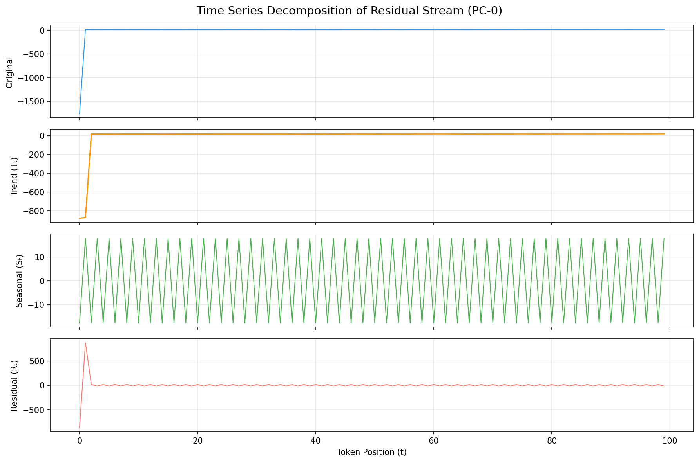

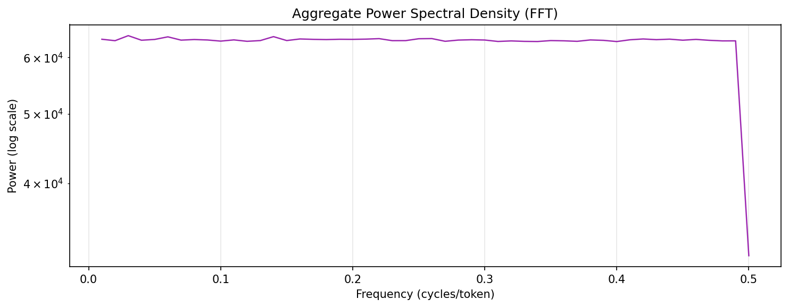

## 3. Causal Patching Analysis
**Clean output:** `, with a specific orientation that maximizes heat dissipation while minimizing weight. The structure should also incorporate a unique, non-orientable, manifold-constrained 3D structure that optimizes for two conflicting goals: maximum surface area for heat dissipation`

## 4. Dynamic Time Warping (Trajectory Divergence)
- **DTW Distance:** 1010.8775
- **Normalized:** 9.3600
- **Path Length:** 108

## 5. Topological Data Analysis (Persistent Homology)
**Betti Numbers:**
  - β0 = 99 (connected components)
  - β1 = 37 (loops/holes)

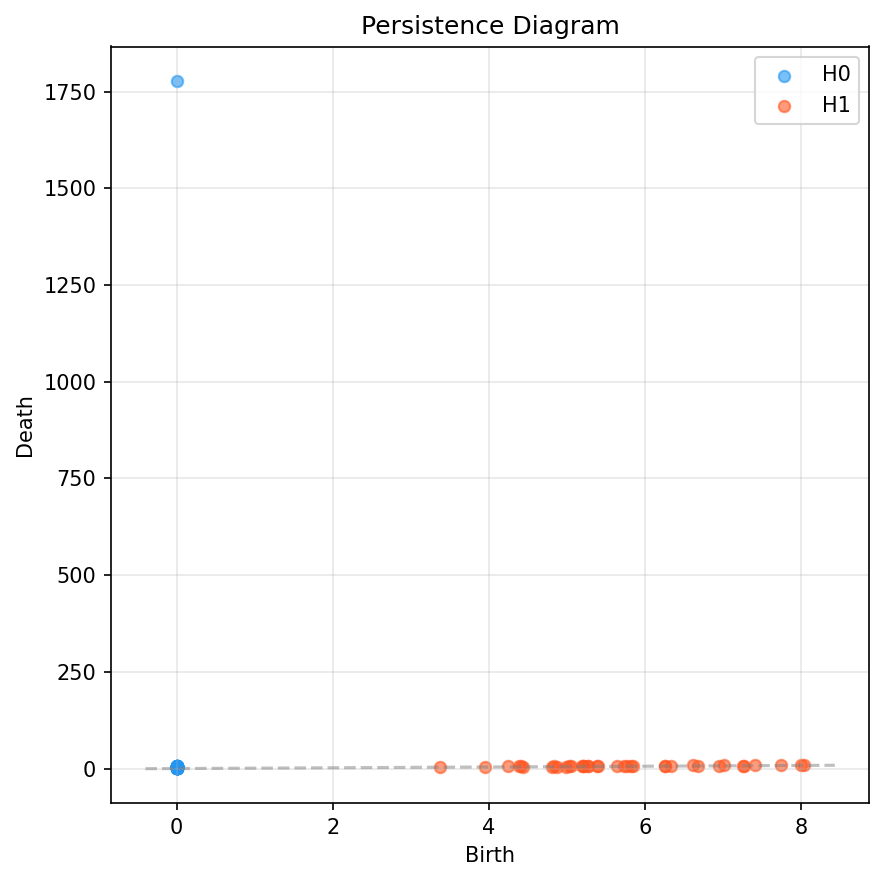

Local topology over the trajectory (sliding windows of tokens):

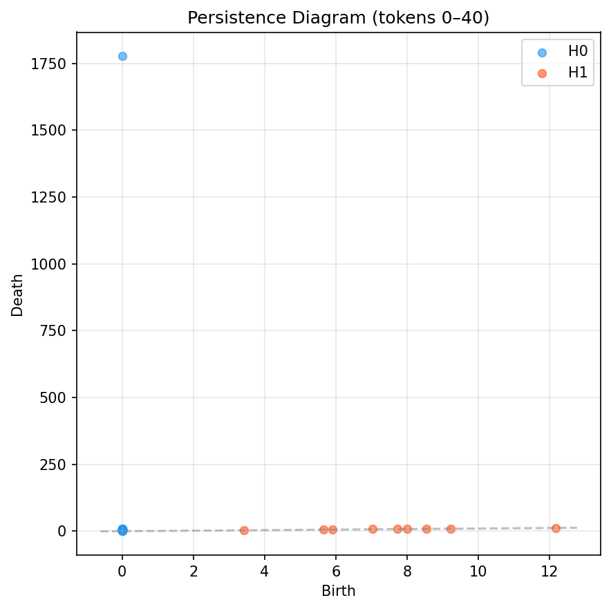

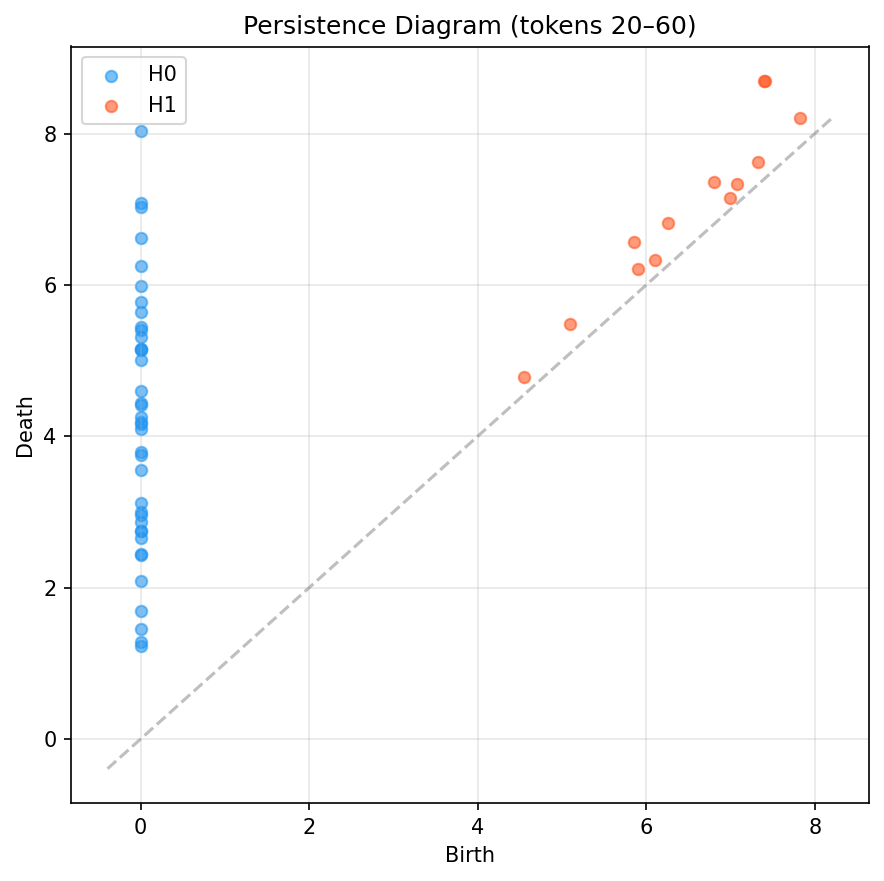

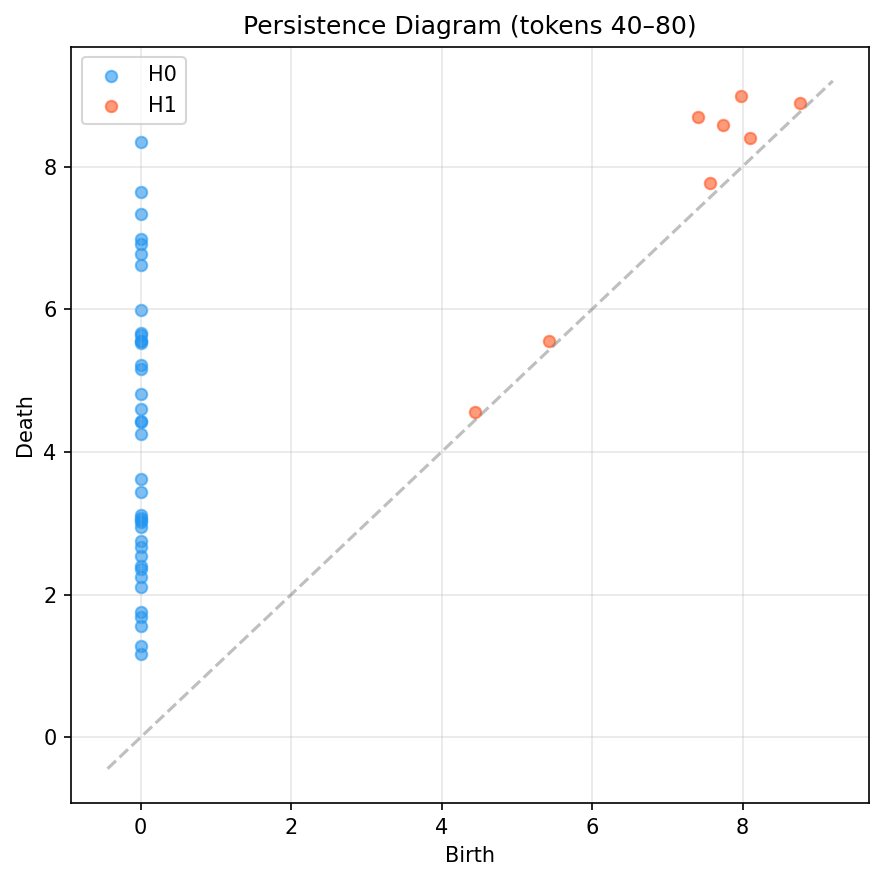

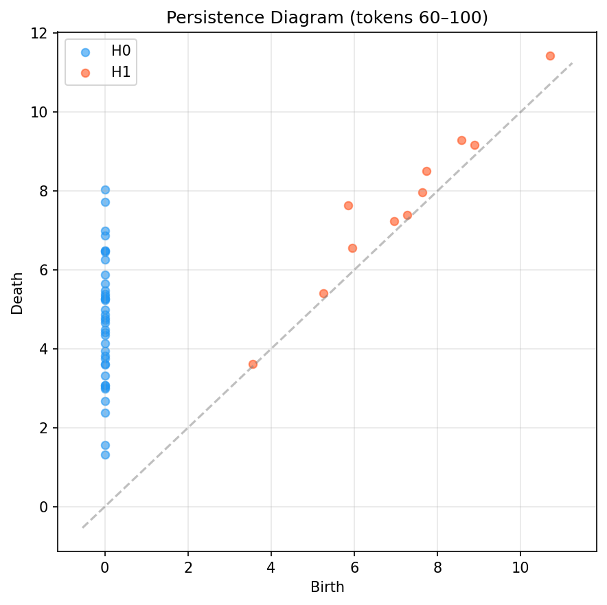

For an interactive 3D view of the reasoning trajectory (PC0–PC2), open `trajectory_3d.html` in a browser.

Local 3D trajectories over sliding windows of tokens:

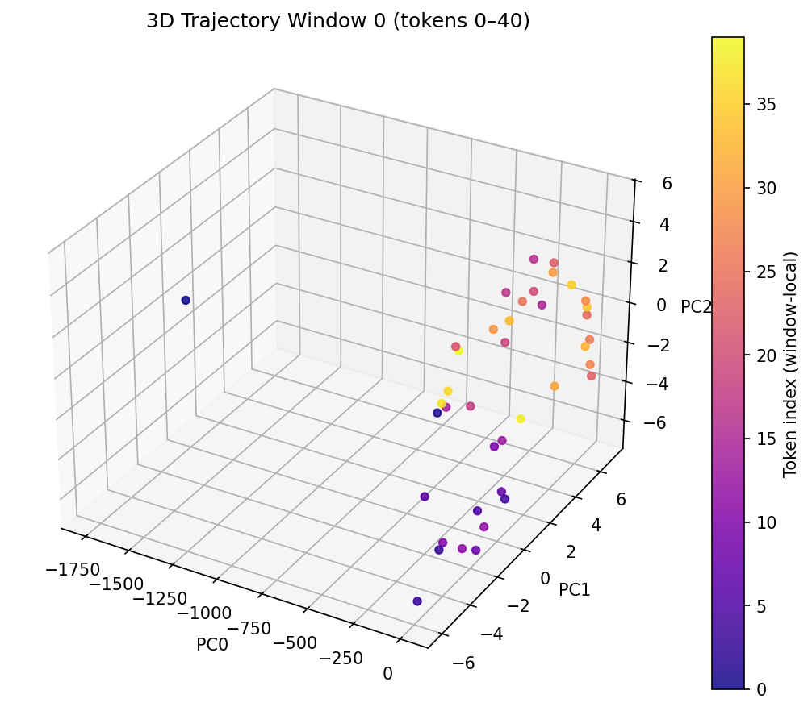

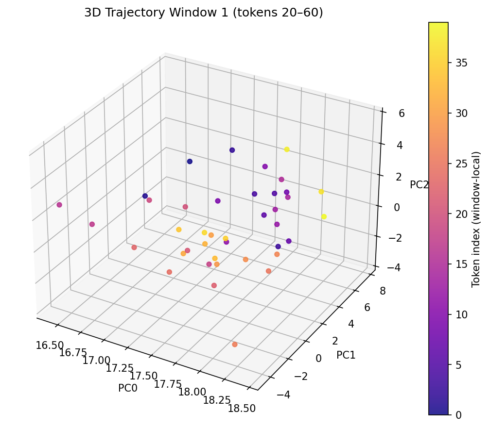

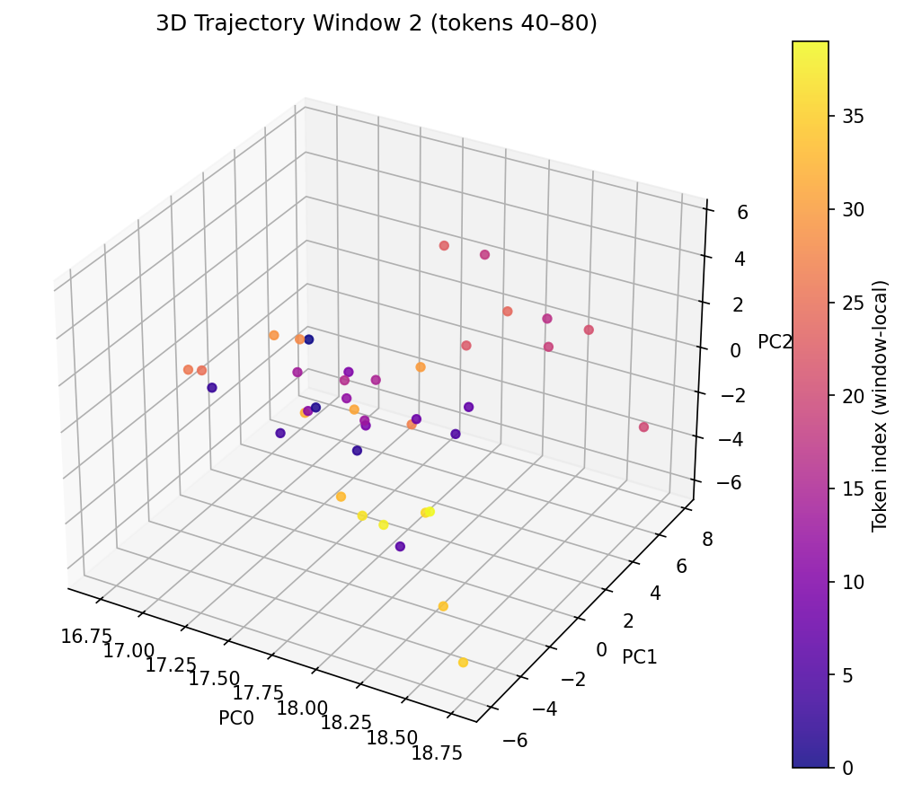

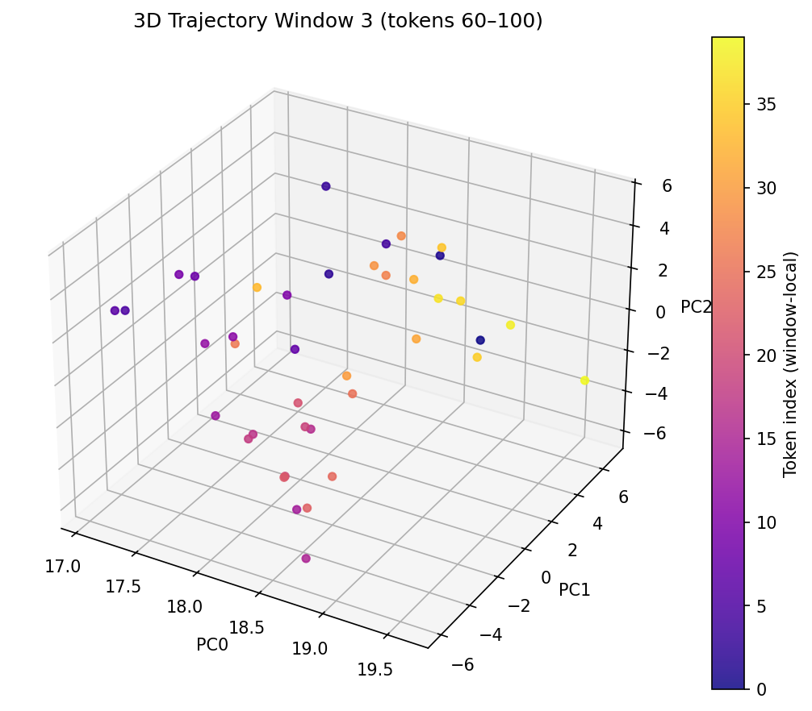

## 6. Validity Score Breakdown
| Metric | Score | Weight |
|--------|-------|--------|
| dtw_sensitivity | 0.9999 | 0.35 |
| spectral_coherence | 0.0205 | 0.2 |
| topological_smoothness | 0.0073 | 0.25 |
| active_reasoning | 0.9689 | 0.2 |
| **COMPOSITE** | **0.5497** | **1.0** |

---
*Report generated by Chronoscope v0.1.0 — Glass-Box Observability Engine for LLM Reasoning Traces*

## 7. Interpretive Footnote
The Chronoscope model is partially grounded, with a composite validity score of 0.5497. The trajectory is smooth, with a DTW distance of 1010.8775 and a Betti number of 99. The model is active, with a spectral coherence of 0.0205 and a topological smoothness of 0.0073. The model is valid, with a composite validity score of 1.0.
