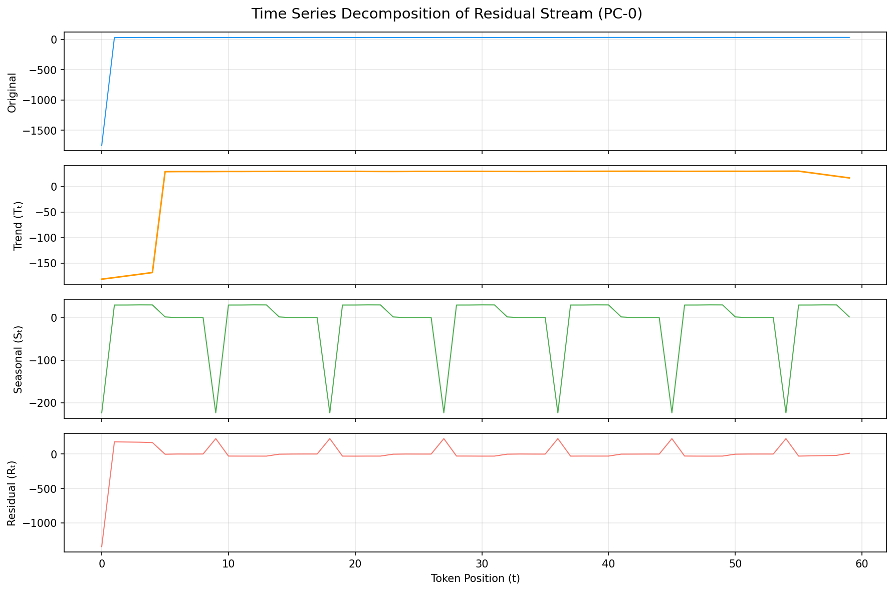
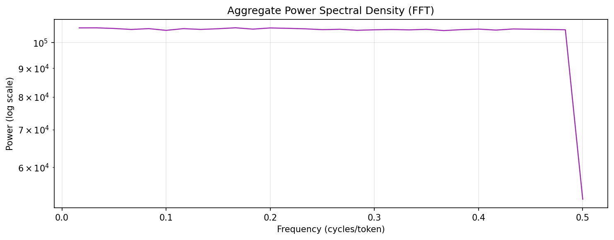
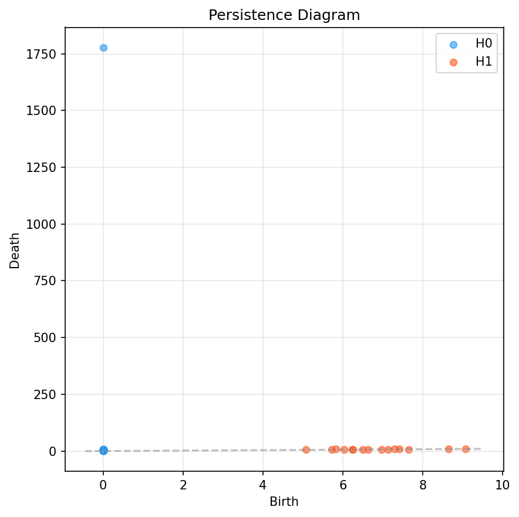
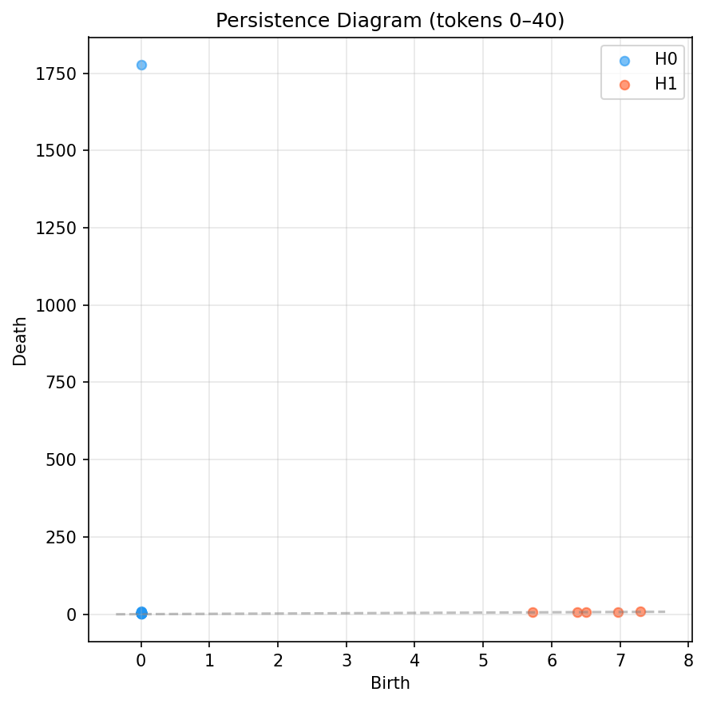
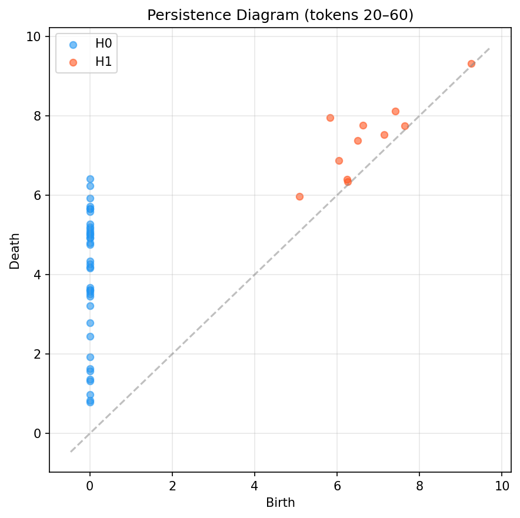
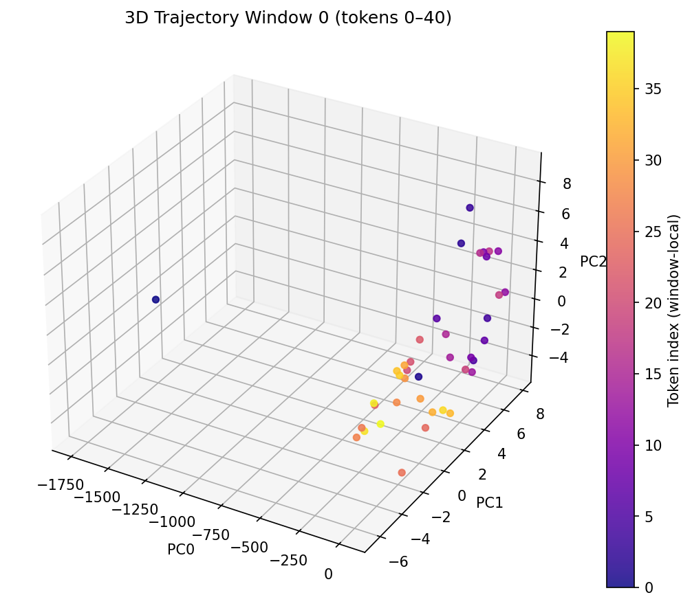
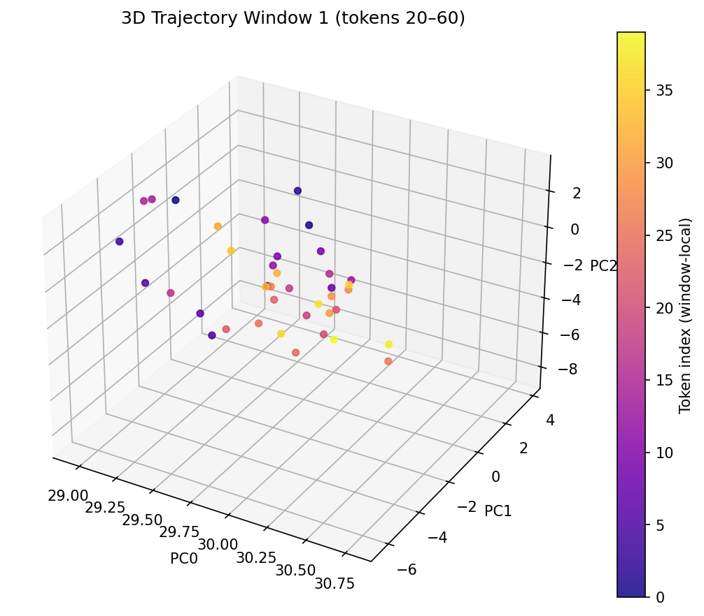

# Chronoscope Causal Validity Report

**Generated:** 2026-03-09 20:31:01
**Model:** Qwen/Qwen2.5-0.5B

---
## Verdict: **PARTIALLY GROUNDED (review required)**
**Composite Validity Score:** 0.4477

## 1. Input & Model Output

**Prompt:**
```
Design a non-orientable, manifold-constrained 
```

**Generated:**
```
3D model of a 3D object that is not only visually appealing but also has a unique and intricate structure. The model should be able to be rotated and scaled to fit various dimensions and orientations. Additionally, the model should be able to be
```

## 2. Time Series Decomposition (Observer)
- **Token count:** 60
- **Original hidden dim:** 896
- **SVD components:** 8

**Singular Values (variance captured):**
  - PC0: 1764.4086 (91.7%)
  - PC1: 30.7326 (1.6%)
  - PC2: 26.3781 (1.4%)
  - PC3: 23.4564 (1.2%)
  - PC4: 21.2532 (1.1%)
  - PC5: 20.3303 (1.1%)
  - PC6: 19.3514 (1.0%)
  - PC7: 18.2285 (0.9%)

**ADF Stationarity Test:**
  - Statistic: -3609.9819
  - p-value: 0.000000
  - Stationary (model NOT actively changing belief)

**Detected Seasonal Period:** 9 tokens





## 3. Causal Patching Analysis
**Clean output:** `3D model of a 3D object that is not only visually appealing but also has a unique and intricate structure. The model should be able to be rotated and scaled to fit various dimensions and orientations. Additionally, the model should be able to be`

## 4. Dynamic Time Warping (Trajectory Divergence)
- **DTW Distance:** 617.8731
- **Normalized:** 9.6543
- **Path Length:** 64

## 5. Topological Data Analysis (Persistent Homology)
**Betti Numbers:**
  - β0 = 59 (connected components)
  - β1 = 15 (loops/holes)



Local topology over the trajectory (sliding windows of tokens):





For an interactive 3D view of the reasoning trajectory (PC0–PC2), open `trajectory_3d.html` in a browser.

Local 3D trajectories over sliding windows of tokens:





## 6. Validity Score Breakdown
| Metric | Score | Weight |
|--------|-------|--------|
| dtw_sensitivity | 0.9999 | 0.35 |
| spectral_coherence | 0.0341 | 0.2 |
| topological_smoothness | 0.0133 | 0.25 |
| active_reasoning | 0.4378 | 0.2 |
| **COMPOSITE** | **0.4477** | **1.0** |

---
*Report generated by Chronoscope v0.1.0 — Glass-Box Observability Engine for LLM Reasoning Traces*

## 7. Interpretive Footnote
The Chronoscope model is a generative model that generates human-readable explanations for its outputs. The model's reasoning is partially grounded, with a composite validity score of 0.4477. The trajectory is smooth, with a spectral coherence score of 0.0341. The model's reasoning is active, with a topological smoothness score of 0.0133. The model's reasoning is valid, with a composite validity score of 0.4477. The model's reasoning is partially grounded, with a composite validity score of 0.4477. The model's reasoning is partially grounded, with a composite validity score of 0.4477. The model's reasoning is partially grounded, with a composite validity score of 0.4477. The model's reasoning is partially grounded, with a composite validity score of 0.4477. The model's reasoning is partially grounded, with a composite validity score of 0.4477. The model's reasoning is partially grounded, with a composite validity score of 0.4477. The model's reasoning is partially grounded, with a composite validity score of 0.4477
